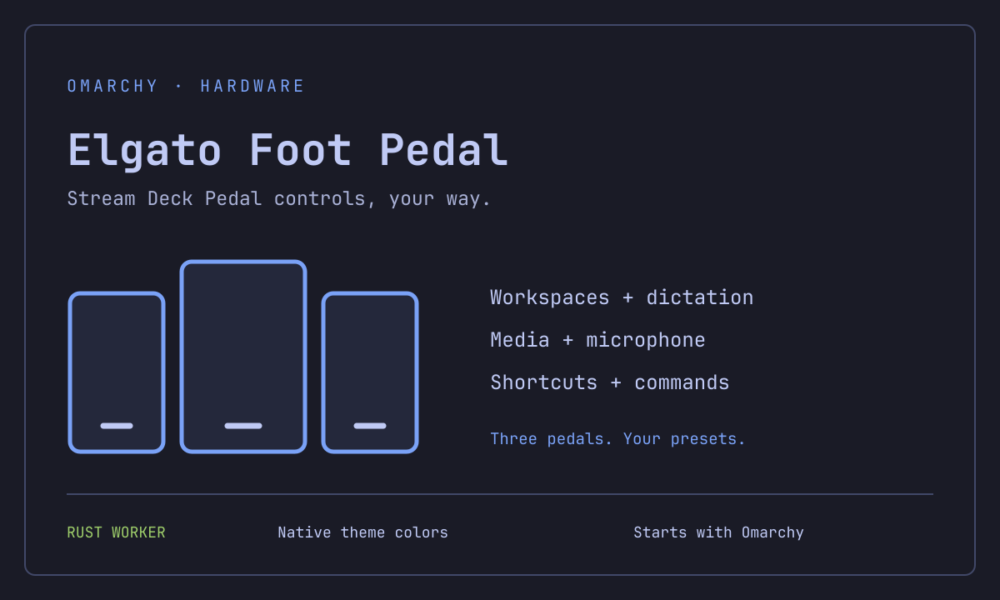
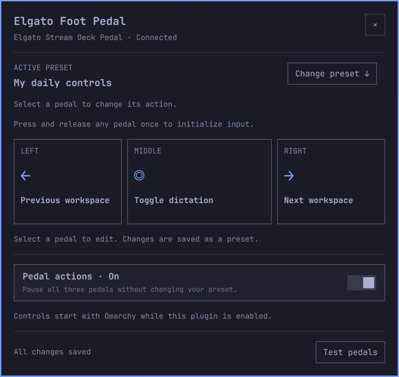

# Elgato Foot Pedal for Omarchy

Elgato **Stream Deck Pedal** controls for Omarchy 4. A small Rust worker handles
USB input and actions; the native QML panel inherits your current Omarchy theme.
MIT licensed. Not affiliated with Elgato.



## Install

```bash
omarchy plugin add https://github.com/sud0n1m/omarchy-foot-pedal.git --enable
```

Click the three-pedal bar icon. Controls start automatically when the plugin is
enabled, including at sign-in. No separate service installation, build step,
Python runtime, download, or administrator access is needed for normal use.
Disabling or removing the plugin stops its worker. A shell restart briefly
interrupts pedal controls; saved presets remain intact.

The repository includes `bin/foot-pedal`, a compiled **Linux x86-64** worker for
Omarchy 4 (glibc 2.39+ and libudev.so.1). Rust is required only to build from source.
See [build instructions and binary provenance](docs/build.md).

Individual actions use existing system tools: `hyprctl`, `voxtype`, `busctl`,
`pactl`, and `wtype`. The panel identifies missing action dependencies.

**Upgrading from 1.x?** Remove the old companion service first using the
[one-time migration steps](docs/migration.md). Fresh installs need no migration.

## Controls

- Presets for workspaces and dictation, media, and push-to-talk.
- Per-pedal shortcuts, commands, media, microphone and workspace actions.
- Save, duplicate, and delete your own presets; built-in presets remain intact.
- Shortcut recording and a test screen that suppresses action execution.
- Pause pedal actions without changing your preset.

The original defaults remain available as **Workspaces + dictation**:

| Left | Middle | Right |
| --- | --- | --- |
| Previous workspace | Toggle Voxtype dictation | Next workspace |



Open the panel from the bar or run:

```bash
omarchy-shell sudonim.foot-pedal open
```

After startup or USB reconnection, press and release a pedal once to initialize
input. Use **Test pedals** to check switches without triggering actions.
Settings remain in `~/.config/foot-pedal/config.json` (or
`$XDG_CONFIG_HOME/foot-pedal/config.json`); version 1 presets are compatible.

### USB permissions

No rule is needed if your system already grants access. If the panel reports
**Device access denied**, this optional administrator command grants the active
local seat access only to the Elgato Stream Deck Pedal (`0fd9:0086`):

```bash
sudo ~/.config/omarchy/plugins/sudonim.foot-pedal/bin/foot-pedal --install-usb-rule \
  && sudo udevadm control --reload-rules
```

It exclusively creates `/etc/udev/rules.d/70-elgato-foot-pedal.rules`. Every
existing path is refused, including identical files, symlinks, directories,
and special files. Stop and inspect existing ownership and contents; do not
delete, move, or overwrite a rule to force installation. Keep a record if you
create this rule. A write failure after creation leaves the new file for manual
inspection, never automatic replacement. Reconnect the pedal afterward.

This command is never called automatically. Do not run the worker as root or
make all HID devices world-writable.

## Update and remove

```bash
omarchy plugin update sudonim.foot-pedal
```

The plugin loads the updated worker with the shell's plugin lifecycle. If an
old version remains loaded after an update, run `omarchy restart shell`.

```bash
omarchy plugin disable sudonim.foot-pedal
# Or remove it completely:
omarchy plugin remove sudonim.foot-pedal
```

Saved presets are retained. There is no independent systemd service to remove
in version 2, and no copied executables outside the plugin folder.

The optional USB rule is a separate manual system change. There is deliberately
no automatic rule deletion. First inspect the file and check package ownership:

```bash
pacman -Qo /etc/udev/rules.d/70-elgato-foot-pedal.rules
sudo cat /etc/udev/rules.d/70-elgato-foot-pedal.rules
```

A “no package owns” result or matching rule contents does **not** prove this
plugin created the file. If a package owns it, follow that package's guidance.
If its origin is uncertain or the path is a symlink, leave it alone. Only if you
know you added the rule yourself and it is not package-owned, use `sudoedit`
to remove just the pedal-specific line you added, preserving all other contents.
Leave the file in place; empty or comment-only rules files are harmless. Then
run `sudo udevadm control --reload-rules` and reconnect the pedal.

## Efficiency and verification

One Rust process waits on HID, filtered udev notifications, and its local Unix
socket. It does not poll connected or disconnected hardware when notifications
are available. Two-second retries are limited to unavailable notifications,
USB access errors, failed microphone restoration, or bounded process recovery.
Test mode has a four-second lease renewed only while the test panel is open.

Connected idle measurements on Omarchy 4.0.4: **about 1.3–1.4 MiB PSS**, zero measured
CPU ticks, and zero unsolicited state packets in separate 30-second samples
with the panel closed and open. PSS excludes the existing Omarchy shell and
these figures do not measure action execution. [Evidence and test scope](docs/verification/README.md).

- [Usage](docs/usage.md)
- [Build, tests and third-party notices](docs/build.md)
- [Paper designs](docs/design/README.md)
- [Changelog](CHANGELOG.md)
- [Report a problem](https://github.com/sud0n1m/omarchy-foot-pedal/issues)
